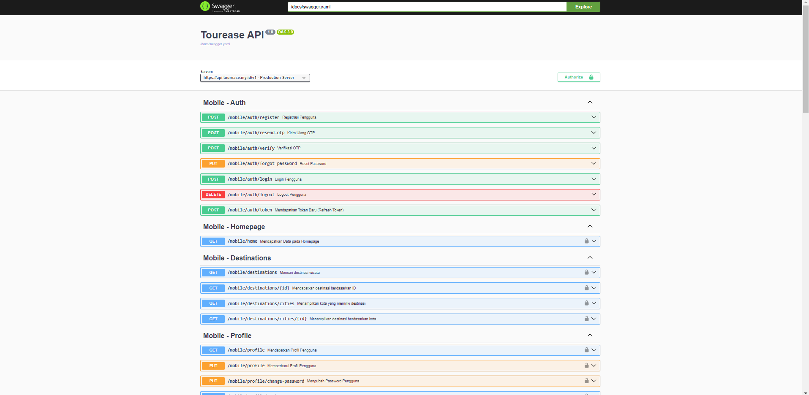
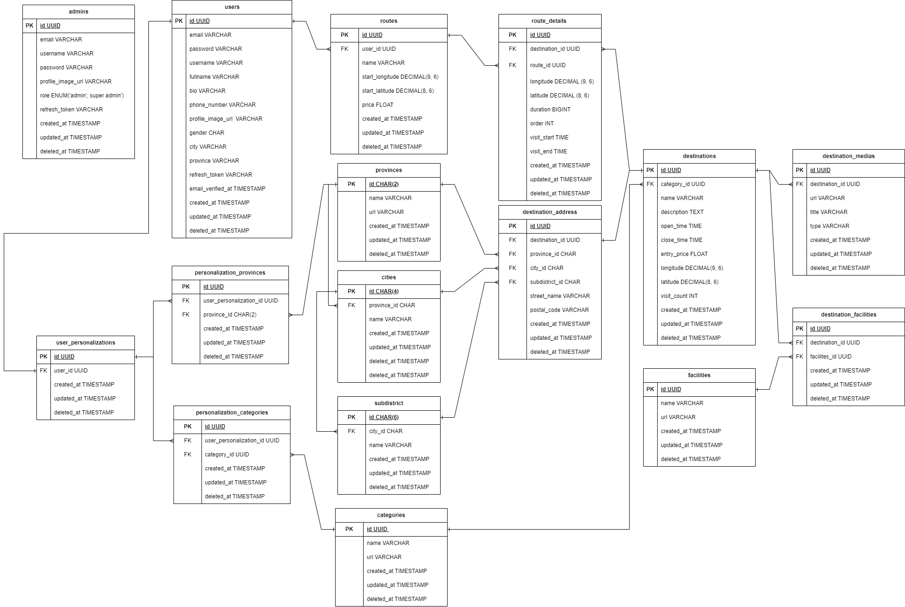

# NutriPlans


## About Project
Tourists often face difficulties in finding accurate and reliable information about tourist destinations in Indonesia. In addition, the lack of personalized recommendations, challenges in planning itineraries, and minimal information on digital facilities at destinations are major pressing problems that require effective solutions.

## Features
### Customer
- Join Membership (Register)
- Insert User Detail
- Access travel routes
- Search Destination
- Personalized Recommendation
- About us
- Video Content
- Landing Page


### Admin
- Landing Page
- Manage User Detail
- Manage User Routes
- Manage Custom Data for OpenAI 
- Manage Contents 
- Manage Destinations

### Super Admin
- Landing Page
- Manage User Detail
- Manage User Routes
- Manage Custom Data for OpenAI 
- Manage Contents 
- Manage Destinations
- Manage Admins

## Tech Stacks
- **Programming Language** : [Golang](https://go.dev/)
- **Framework** : [Echo](https://echo.labstack.com/)
- **ORM** : [GORM](https://gorm.io/index.html)
- **Database** : [MySQL](https://www.mysql.com/)
- **Authentication** : [JWT](https://jwt.io/)
- **Caching** : [Redis](https://redis.io/)
- **AI Service** : [OpenAI](https://openai.com/), [Gemini](https://ai.google.dev/gemini-api?gad_source=1&gclid=Cj0KCQjwj9-zBhDyARIsAERjds3iMJzrAIzu_GLkxoJPLqJPjbd87ok8IKDTf3aSWlkcbmseVWi853AaAs7MEALw_wcB)
- **Media Storage** : [Cloudinary](https://cloudinary.com/)
- **Version Control** : [Git](https://git-scm.com/), [GitHub](https://github.com/)
- **CI/CD** : [GitHub Actions](https://github.com/features/actions)
- **Containerization** : [Docker](https://www.docker.com/)
- **Deployments** : [AWS EC2](https://aws.amazon.com/ec2/), [AWS ECS](https://aws.amazon.com/ecs/), [AWS RDS](https://aws.amazon.com/rds/)
- **Proxy & DNS Management** : [Cloudflare](https://www.cloudflare.com/)

## API Documentation
[Tourease API](https://api.tourease.my.id/docs)

## ERD


## Setup 
### Prerequisites
- **Golang**
- **Redis**

## Getting Started
1. Clone the repository
    ```sh
    git clone https://github.com/Capstone-Project-Sustain-Tour-Group-3/backend-capstone.git
    ```
2. Navigate to project directory
    ```sh
    cd backend-capstone
    ```
3. Create `.env` file and fill the environment data.
    ```sh
    cp .env.example .env
    ```
4. Install dependencies.
    ```sh
    go mod download
    go mod tidy
    ```
5. Run the server.
    - with ***seed***
      ```sh
      go run main.go --seed
      ```
    - without ***seed***
      ```sh
      go run main.go
      ```